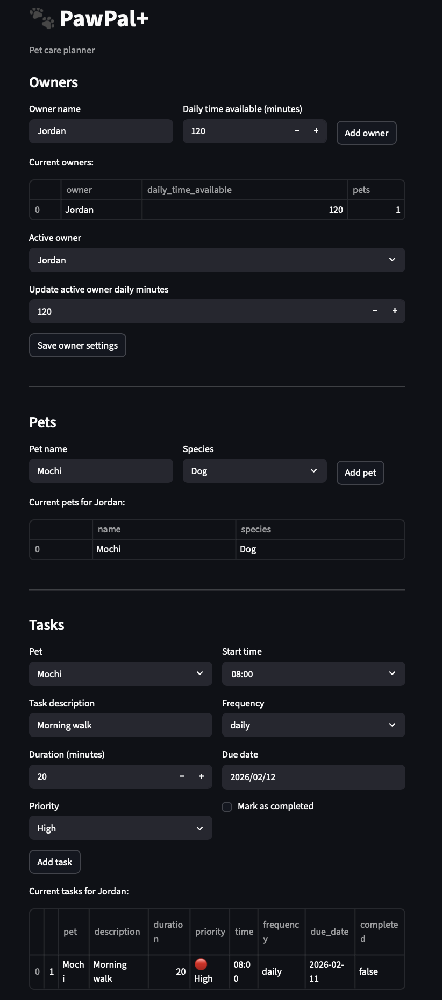
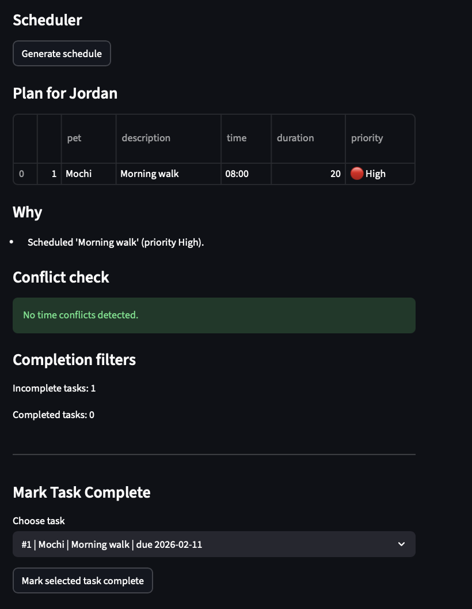

# PawPal+

PawPal+ is a Streamlit app for planning pet care tasks across multiple owners and pets.
It builds a daily schedule using priority and time constraints, explains scheduling decisions, and persists data between runs.

## Core Features

- Multi-owner support with separate pet/task data per owner
- Pet management per owner (add pets, view pet list)
- Task management with:
  - description
  - duration
  - start time
  - priority level (`Low`, `Medium`, `High`)
  - recurrence (`daily`, `weekly`, `monthly`)
  - completion status
  - due date
- Daily schedule generation with explanation output
- Task completion workflow with recurrence handling
- JSON persistence (`data.json`) for owners, pets, and tasks

## Scheduling Algorithms

- Priority-based scheduling: tasks are ordered by priority first (`High > Medium > Low`)
- Time-based tiebreaker: tasks with same priority are ordered by earlier start time
- Time-budget filtering: tasks that exceed remaining daily minutes are skipped
- Completion filtering: completed tasks are excluded from newly generated plans
- Conflict warnings: overlapping task windows are detected and reported
- Recurrence generation: completing a `daily` or `weekly` task auto-creates the next occurrence

## How Scheduling Works

When you click **Generate schedule**, the scheduler:

1. Collects all tasks for the active owner.
2. Sorts tasks by priority, then by start time.
3. Iterates through tasks and schedules only those that fit remaining daily time.
4. Produces a human-readable explanation for each scheduled or skipped task.
5. Runs conflict detection to warn about overlapping tasks.

## Run the App

```bash
python -m venv .venv
source .venv/bin/activate  # Windows: .venv\Scripts\activate
pip install -r requirements.txt
streamlit run app.py
```

## Run Tests

If tests import `pawpal_system` from project root, run:

```bash
PYTHONPATH=. .venv/bin/pytest -q
```

To run a single test:

```bash
PYTHONPATH=. .venv/bin/pytest -q test/test_pawpal.py::test_ordering_by_priority_then_duration
```

## Data Persistence

- Data is saved to `data.json`
- Save occurs after owner/pet/task updates and task completion events
- Data is loaded automatically on app startup


## Project Files

- `app.py`: Streamlit UI and state handling
- `pawpal_system.py`: domain model (`Owner`, `Pet`, `Task`) and `Scheduler`
- `test/test_pawpal.py`: pytest coverage for core scheduling/model behavior
- `data.json`: persisted app data

## Demo


