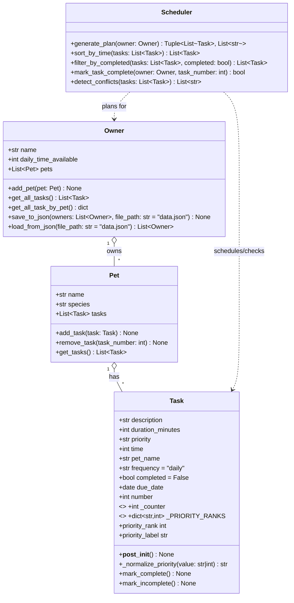

# Diagram

classDiagram
    class Task {
        +description: str
        +duration_minutes: int
        +priority: int
        +frequency: str
        +completed: bool
        +mark_complete() void
        +mark_incomplete() void
    }

    class Pet {
        +name: str
        +species: str
        +tasks: list~Task~
        +add_task(task: Task) void
        +remove_task(task_description: str) bool
        +get_tasks() list~Task~
    }

    class Owner {
        +name: str
        +daily_time_available: int
        +pets: list~Pet~
        +add_pet(pet: Pet) void
        +get_all_tasks() list~Task~
    }

    class Scheduler {
        +generate_plan(owner: Owner) tuple~list~Task~, list~str~~
    }

    Owner "1" --> "0..*" Pet : owns
    Pet "1" --> "0..*" Task : has
    Scheduler ..> Owner : uses constraints
    Scheduler ..> Task : schedules

# Final Diagram

classDiagram
    class Task {
        +description: str
        +duration_minutes: int
        +priority: int
        +time: int
        +pet_name: str
        +frequency: str
        +completed: bool
        +due_date: date
        +number: int
        +mark_complete() void
        +mark_incomplete() void
    }

    class Pet {
        +name: str
        +species: str
        +tasks: list~Task~
        +add_task(task: Task) void
        +remove_task(task_number: int) void
        +get_tasks() list~Task~
    }

    class Owner {
        +name: str
        +daily_time_available: int
        +pets: list~Pet~
        +add_pet(pet: Pet) void
        +get_all_tasks() list~Task~
        +get_all_task_by_pet() dict
    }

    class Scheduler {
        +generate_plan(owner: Owner) tuple~list~Task~, list~str~~
        +sort_by_time(tasks: list~Task~) list~Task~
        +filter_by_completed(tasks: list~Task~, completed: bool) list~Task~
        +mark_task_complete(owner: Owner, task_number: int) bool
        +detect_conflicts(tasks: list~Task~) list~str~
    }

    Owner "1" --> "0..*" Pet : owns
    Pet "1" --> "0..*" Task : has
    Scheduler ..> Owner : uses
    Scheduler ..> Task : schedules

